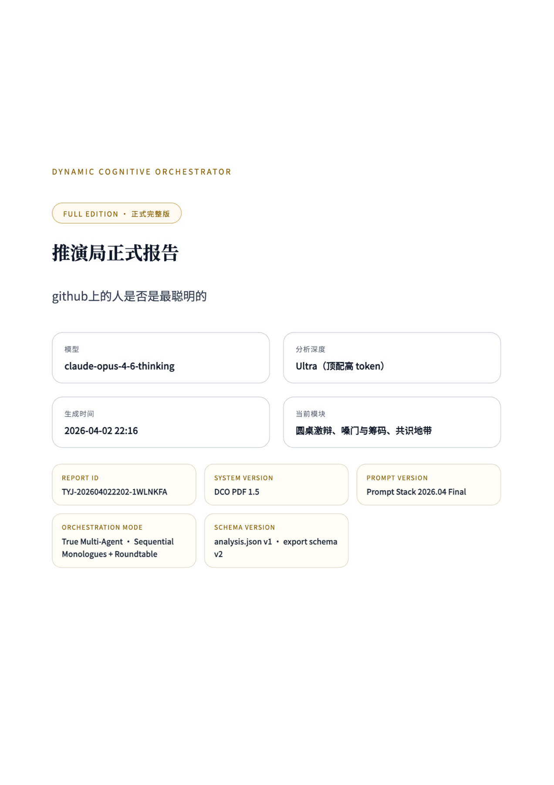

# 推演局 · Dynamic Cognitive Orchestrator

一个把“单一提问”升级成“多视角推演”的黑金风格认知分析系统。

推演局不会直接给你一个平面的答案，而是先拆议题、再动态选角、让多个互相隔离的 Agent 进入暗房独白，在需要时开启圆桌激辩，最后由“局长”把碎片拼成一份结构化真相报告。



## 这是什么

当用户输入一个议题后，系统会按以下链路工作：

1. 拆出冲突轴和隐藏变量
2. 动态生成一组彼此利益不同、信息不同、处境不同的 Agent
3. 让每个 Agent 在“互相隔离的暗房”里用第一人称独立发言
4. 在 `Pro / Ultra` 档位下加入“圆桌激辩”，把隐性分歧显性化
5. 由局长输出结构化总结、行动建议与事实/推断/情绪分层

它更像一台“推演终端”，而不是普通问答页面。

## 产品结构

- `议题输入`：输入一个争议、事件、行业判断或社会问题
- `选角总览`：展示议题类型、冲突轴、角色阵容和议题拆解
- `独立思考暗房`：每位 Agent 以自己的利益和局限独立发言
- `圆桌激辩`：仅在 `Pro / Ultra` 档位开启，强化反驳与碰撞
- `局长整合报告`：输出 30 秒结论、结构报告、行动建议和附加模块

## 这个项目适合谁

- 想把一个话题从“单答案”变成“多方处境图”的人
- 做内容、研究、咨询、投资、产品、组织分析的人
- 需要一份更适合展示、分享、归档的 AI 结构化报告的人

## 亮点

- 真正的多阶段流式体验：不是等整段写完再一起出现
- 单一真源角色命名：`id / display_name / alias`
- Agent 话风差异化：不是“同一作者分饰多角”
- `full / share` 双导出模式
- 30 秒结论页、目录页、系统版本信息、增强模块清单
- 黑金气质的“推演终端”式界面，而不是普通表单页

## 导出模式

### `full`

面向完整阅读、归档、复盘。

默认结构：

- 封面
- 30 秒结论页
- 目录与模块总览
- 推演过程提示
- 选角总览
- 独立思考暗房
- 圆桌激辩（如有）
- 局长整合报告

### `share`

面向快速转发、社交传播和快速阅读。

默认结构：

- 封面
- 30 秒结论页
- 选角总览（压缩版）
- 暗房金句精选
- 圆桌激辩精选片段
- 局长报告核心结论
- 3 条行动建议

## 演示样例

当前仓库已经附带一份真实导出的演示报告：

- [《github 上的人是否是最聪明的》完整 PDF](docs/demo/github-smartest-report.pdf)

这个样例适合直接拿来展示：

- 封面与版本信息
- 30 秒结论页
- 正式 PDF 版式
- 推演局的整体成品感

## 本地运行

```bash
cd "/Users/dutaorui/Desktop/codex/不同角度对话"
python3 -m venv .venv
source .venv/bin/activate
pip install -r requirements.txt
python -m uvicorn main:app --host 127.0.0.1 --port 8000
```

然后直接在浏览器打开：

- `index.html`
- `http://127.0.0.1:8000/api/health`

## 项目文件

- [index.html](index.html)：前端主界面、导出和阅读体验
- [main.py](main.py)：FastAPI 后端、多 Agent 编排与 SSE
- [export_utils.js](export_utils.js)：导出白名单、quick summary、share 提炼逻辑
- [system.md](system.md)：全局系统提示词
- [docs/visual-direction.md](docs/visual-direction.md)：视觉方向说明

## 技术栈

- FastAPI
- httpx
- OpenAI-compatible relay API
- 原生 HTML / CSS / JavaScript
- SSE 流式输出
- 客户端 PDF / TXT 导出

## 仓库定位

这不是通用 Agent 框架，而是一个已经带明显产品形态的多 Agent 推演原型。

它的重点不是“让 AI 回答问题”，而是：

- 让多个互相隔离的视角发声
- 把冲突、利益、误判和情绪拆开
- 最终输出一份可读、可传、可展示的正式报告
